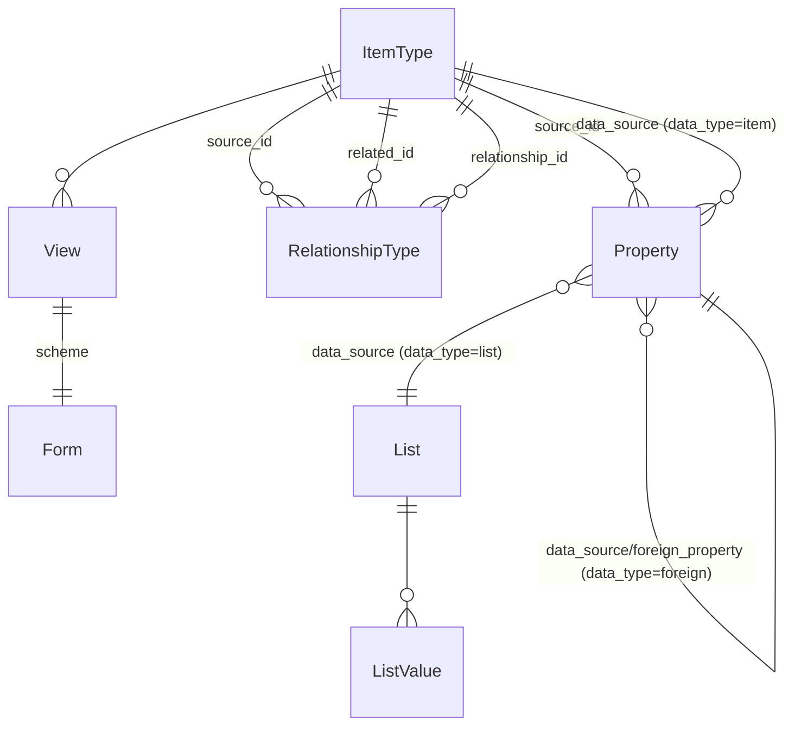
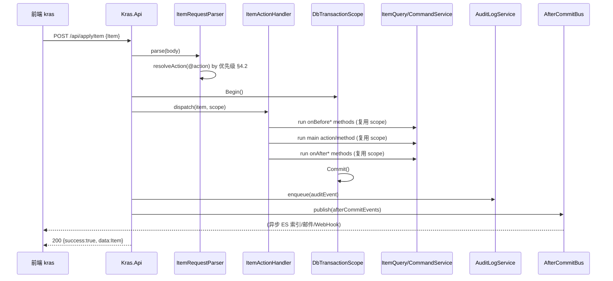
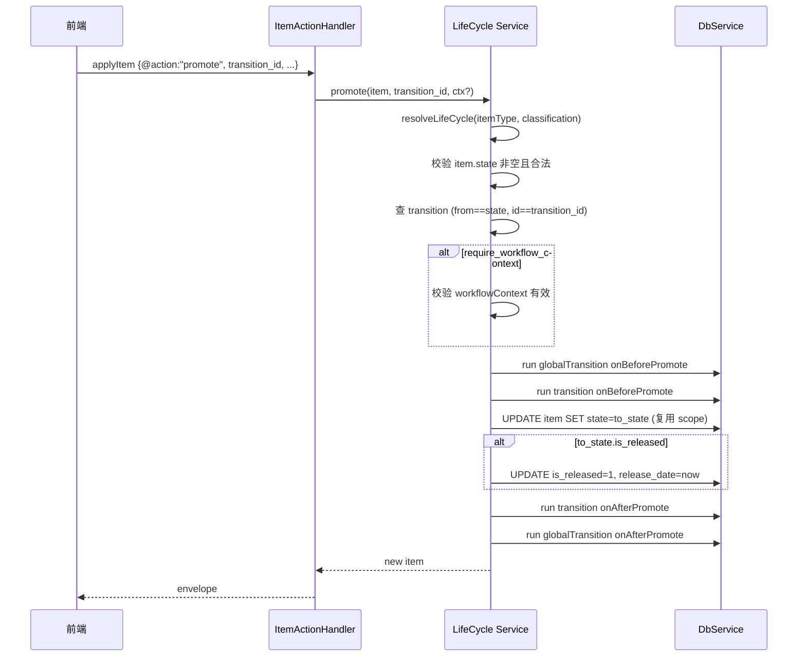
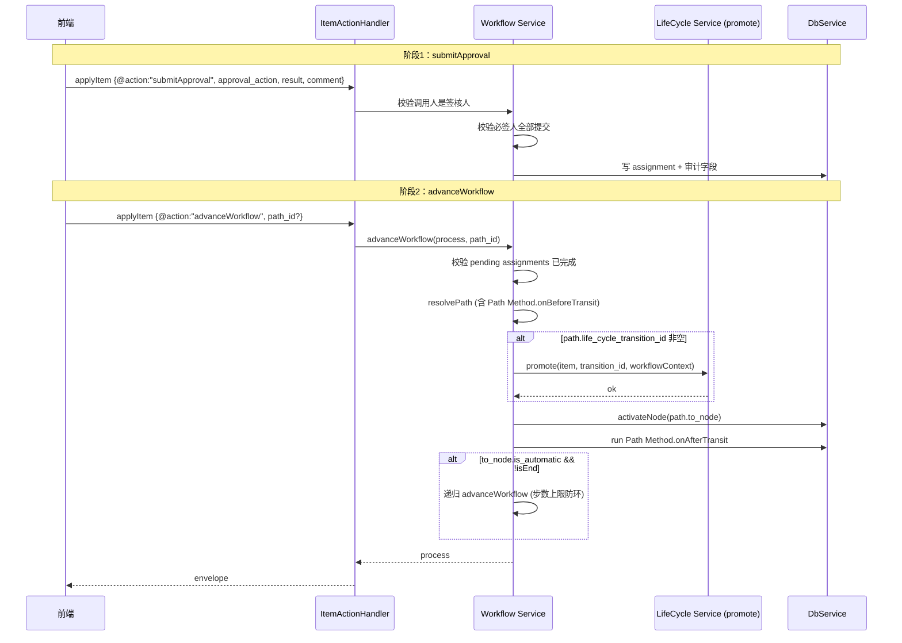
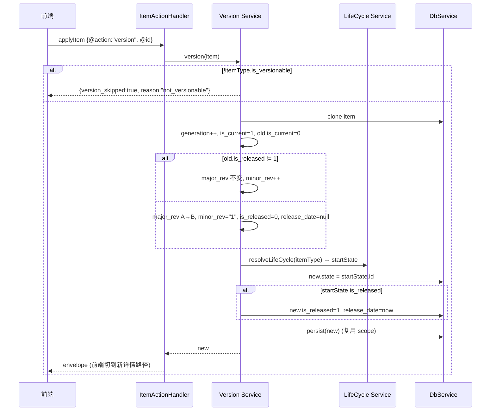
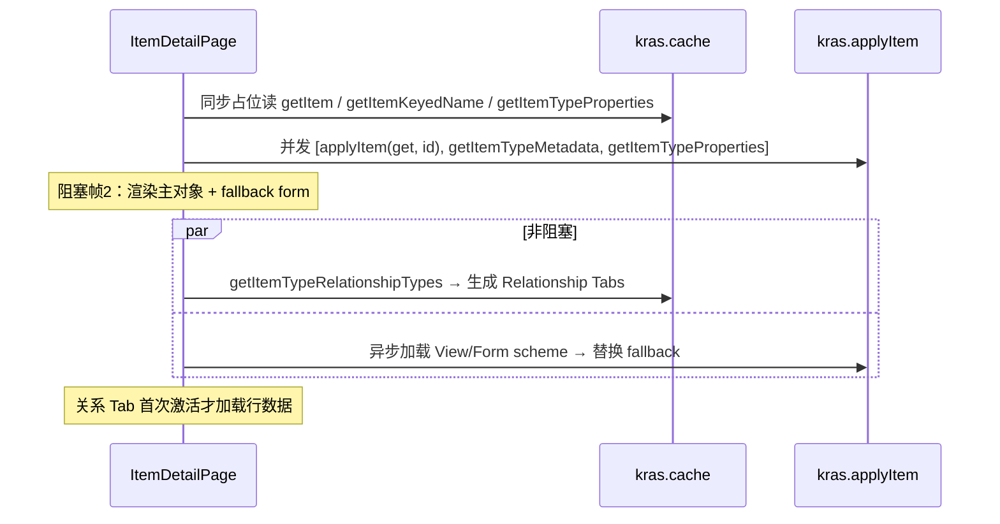

# Kras 平台技术设计文档

> 配套需求：`requirements.md`（摘要） / 原始需求文档（详）
> 设计日期：2026-06-17
> 适用版本：Kras 主干（AML 协议 2.x，前端 `kras-web-vue`）
>
> 说明：当前工作区为空仓库，本设计严格基于原始需求文档推断产出。凡需求未明确、需在落地阶段进一步确认的点，统一标注 `[待确认]`。涉及现有共享文件（`AGENTS.md` 22.3 清单）的协作边界，按需求 §18 的描述推断。

---

## 目录

- [1. 总体架构](#1-总体架构)
  - [1.1 分层视图](#11-分层视图)
  - [1.2 部署与运行拓扑](#12-部署与运行拓扑)
  - [1.3 关键设计决策](#13-关键设计决策)
- [2. 元数据驱动体系（核心）](#2-元数据驱动体系核心)
  - [2.1 数据模型](#21-数据模型)
  - [2.2 元数据语义约束的实现](#22-元数据语义约束的实现)
  - [2.3 元数据缓存策略](#23-元数据缓存策略)
  - [2.4 字段级权限链路](#24-字段级权限链路)
- [3. 前端 kras 运行时（核心）](#3-前端-kras-运行时核心)
  - [3.1 全局 kras 对象分层](#31-全局-kras-对象分层)
  - [3.2 缓存与失效](#32-缓存与失效)
  - [3.3 详情页加载与编辑流](#33-详情页加载与编辑流)
  - [3.4 View 编辑器与表单协议](#34-view-编辑器与表单协议)
  - [3.5 列表页 ItemTypeTable](#35-列表页-itemtypetable)
- [4. 统一数据协议 Item / AML](#4-统一数据协议-item--aml)
- [5. 事务与副作用](#5-事务与副作用)
- [6. 权限与安全](#6-权限与安全)
- [7. 版本管理](#7-版本管理)
- [8. 生命周期 LifeCycle](#8-生命周期-lifecycle)
- [9. 工作流 Workflow](#9-工作流-workflow)
- [10. 方法体系（双轨扩展）](#10-方法体系双轨扩展)
- [11. 文件与存储](#11-文件与存储)
- [12. 菜单管理](#12-菜单管理)
- [13. AI 能力](#13-ai-能力)
- [14. 审计与可观测](#14-审计与可观测)
- [15. DbInit 数据库初始化](#15-dbinit-数据库初始化)
- [16. 前端页面与路由](#16-前端页面与路由)
- [17. 性能要求实现路径](#17-性能要求实现路径)
- [18. 关键时序](#18-关键时序)
- [19. 风险与遗留事项](#19-风险与遗留事项)
- [20. 落地里程碑建议](#20-落地里程碑建议)

---

## 1. 总体架构

### 1.1 分层视图

```
┌─────────────────────────────────────────────────────────────────┐
│                    前端 kras-web-vue (Vue 3)                    │
│  ┌───────────────┐  ┌──────────────┐  ┌────────────────────┐   │
│  │  Ant Design v6│  │  路由 / Tab  │  │  全局 kras 运行时  │   │
│  │  组件 / View   │  │  / 页面壳    │  │  (cache/objects/   │   │
│  │  编辑器        │  │              │  │   metadata/search) │   │
│  └──────┬────────┘  └──────┬───────┘  └─────────┬──────────┘   │
│         └────────────────────┴───────────────────┘              │
│                       HTTP (统一 envelope)                       │
└─────────────────────────────────┬───────────────────────────────┘
                                  │
┌─────────────────────────────────▼───────────────────────────────┐
│                     Kras.Api (.NET Host)                        │
│  ┌──────────────────────────────────────────────────────────┐  │
│  │ Protocol 层                                               │  │
│  │  ItemRequestParser / AmlRequestParser / ResponseFactory   │  │
│  │  统一 envelope / 错误码 / 限流中间件 / 认证中间件          │  │
│  └────────────────────────────┬─────────────────────────────┘  │
│  ┌─────────────────────────────▼────────────────────────────┐  │
│  │ Service 层 (Kras.Service)                                 │  │
│  │  Item: Query/Command/ActionHandler                        │  │
│  │  Db:   SqlQueryExecutor / DbTransactionScope / DbService  │  │
│  │  Auth: PasswordHasher / Access 判定                       │  │
│  │  Methods/BuiltIn: Search/Workflow/LifeCycle/File/...      │  │
│  │  Search: ElasticItemSearchService                         │  │
│  │  Ai:   AiRuntime / AiScenarioAdapters                     │  │
│  └────────────────────────────┬─────────────────────────────┘  │
│  ┌─────────────────────────────▼────────────────────────────┐  │
│  │ Core 层 (Kras.Core)                                       │  │
│  │  ItemType / Property / RelationshipType / Item 基类       │  │
│  │  ConstItemTypeId / Attributes / 值对象                    │  │
│  └────────────────────────────────────────────────────────────┘ │
│  ┌──────────────────────────────────────────────────────────┐  │
│  │ Infrastructure: Cache / BackgroundJobs(Audit) / LSP       │  │
│  └──────────────────────────────────────────────────────────┘  │
└─────────────────────────────────┬───────────────────────────────┘
                                  │
              ┌───────────────────┼──────────────────┐
              ▼                   ▼                  ▼
        关系型数据库           ElasticSearch        文件存储
        (schema dbo,         (is_es_index=true     (Vault,
         snake_case)           的 ItemType)         分片上传)
```

#### 后端分层职责

| 层 | 项目 | 职责 | 禁止 |
| --- | --- | --- | --- |
| **Core** | `Kras.Core` | 模型定义：`Item` 基类、内置 ItemType 模型（`ItemType`/`Property`/`RelationshipType`/`User`/`Permission` 等）、`ConstItemTypeId`、`Attributes`（PropertyAttribute）、值对象 | DB 访问、协议解析、IO |
| **Service** | `Kras.Service` | 系统能力：`ItemQueryService` / `ItemCommandService` / `ItemActionHandler`（action 分发）、`DbService.*` partial、`SqlQueryExecutor` / `DbTransactionScope`、`PasswordHasher`、`Methods/BuiltIn/*`、`ElasticItemSearchService`、`Ai/*` | HTTP 协议、响应 envelope |
| **Api** | `Kras.Api` | 接口编排与协议转换：`Program.Shared.cs`（协议解析 / 响应封装 / 元数据查询 / 字段裁剪 / 关系加载 / 审计 / 缓存）、`ItemRequestParser` / `AmlRequestParser`、`ApiResponseFactory`、`DependencyInjection/ServiceCollectionExtensions`、限流 / 认证中间件、LSP / Menu / AI 端点 | 业务规则下沉到 Service；Api 层只做编排 |
| **DbInit** | `Kras.DbInit` | 建库建表、`BuildSystemProperties`、`DefaultSystemColumns`、`DefaultSystemPropertyItems`、生成 `fn_CheckEntityAccess` | 运行期业务逻辑 |

> **关键边界**：业务规则、权限判定、SQL 构造 MUST 落在 Service 层；Api 层只做协议解析 + 编排 + 响应封装；Core 层保持零依赖（除基础库）。

### 1.2 部署与运行拓扑

- **Web 进程**：`Kras.Api` 单 Host，承载 HTTP 端点 + 后台 `AuditLogBackgroundService` + LSP host。
- **DbInit**：独立可执行程序（`Program.cs`），首次部署与版本升级时执行；幂等。
- **ES**：可选组件；`ItemType.is_es_index=true` 时启用，否则 quickSearch 回退 DB `LIKE`。
- **文件存储**：Vault 抽象，本地磁盘 / 对象存储 `[待确认]`。

### 1.3 关键设计决策

#### 决策 D1：ID 规范

- **决策**：所有业务 ID 由统一 `IIdGenerator` 产出 **32 位无连字符大写十六进制**串。
- **理由**：需求 §1.3 明确禁止带连字符 UUID；与 Aras Innovator AML 历史格式兼容。
- **实现**：
  - Core 层 `IIdGenerator.NewId()` 返回 `string`，32 位大写。
  - 内部用 `Guid.NewGuid().ToString("N").ToUpperInvariant()`。
  - DbInit 种子数据 ID 集中在 `ConstItemTypeId`，硬编码常量。
- **约束**：禁止任何路径使用 `Guid.ToString()` / `ToString("D")` / 小写形式落库。

#### 决策 D9：元数据三类加载语义

- **决策**：登录后并发拉取 ItemType / Property / RelationshipType 三类元数据，统一写内存 + localStorage；只读缓存命中失败直接返回空值，不在缓存层补请求。
- **理由**：需求 §3.3。缓存层职责单一（读），避免缓存层隐式触发网络请求导致难以追踪的链式加载。

---

## 2. 元数据驱动体系（核心）

### 2.1 数据模型

> 下表只列出与设计强相关的字段；完整字段定义在落地阶段以 `Property` 元数据自描述（即 `ItemType` / `Property` 本身也通过 `Property` 描述自身字段）。表名为示例命名 `[待确认]`，统一遵守 schema `dbo` + `snake_case`。

#### 2.1.1 ItemType（业务对象类型）

| 字段 | 类型 | 说明 |
| --- | --- | --- |
| `id` | char(32) | 主键，`ConstItemTypeId.ItemType` |
| `name` | nvarchar | 类型名（如 `Part`），全局唯一 |
| `label` | nvarchar | 显示标签（菜单/列表标题） |
| `is_relationship` | bit | 是否关系类 |
| `is_versionable` | bit | 是否可换版 |
| `implementation_type` | nvarchar | 实现类型（`Table` 等） |
| `class_structure` | nvarchar(max) | 类结构 JSON（分类树） |
| `default_page_size` | int | 列表默认页大小 |
| `icon` | nvarchar | 图标标识 |
| `is_es_index` | bit | 是否启用 ES 索引 |
| `is_hidden` | bit | 是否系统隐藏（不进菜单） |
| `managed_by_id` | char(32) | 管理者 Identity |
| `owned_by_id` | char(32) | 所有者 Identity |
| `team_id` | char(32) | 团队 |

#### 2.1.2 Property（字段定义，ItemType 的关系类）

| 字段 | 类型 | 说明 |
| --- | --- | --- |
| `id` | char(32) | 主键 |
| `source_id` | char(32) | 所属 ItemType.id |
| `name` | nvarchar | 字段名 |
| `label` | nvarchar | 显示标签 |
| `data_type` | nvarchar | `string/text/integer/decimal/boolean/date/list/item/foreign/filter list/...` |
| `data_source` | char(32) | 见 §2.2 语义约束 |
| `foreign_property` | char(32) | `data_type=foreign` 时指向目标 Property.id |
| `precision` / `scale` / `max_length` | int | 数值/字符串精度 |
| `is_required` | bit | 必填 |
| `is_unique` | bit | 唯一 |
| `default_value` | nvarchar | 默认值 |
| `sort_order` | int | 字段顺序 |
| `column_width` | int | 列宽 |
| `column_alignment` | nvarchar | 列对齐 |
| `is_hidden` / `is_hidden2` | bit | 列隐藏标记 |
| `field_permission_id` | char(32) | 字段权限（指向 Permission.id） |
| `external_property` | nvarchar | 外部属性 |
| `item_behavior` | nvarchar | Item 行为 |

> `Property` 自身是 `ItemType` 的 RelationshipType，因此也走 `source_id`（指向 ItemType）。

#### 2.1.3 RelationshipType（关系类型）

| 字段 | 说明 |
| --- | --- |
| `id` | 主键 |
| `name` | 关系名 |
| `source_id` | 源 ItemType.id |
| `related_id` | 相关 ItemType.id |
| `relationship_id` | 关系对象类型 ItemType.id（**必填**，缺失报错） |

#### 2.1.4 List / List Value

- `List`：枚举字典（id / name / label）。
- `List Value`：`List` 的关系类，存 value/label/sort_order。

#### 2.1.5 View / Form

- `View`：列表/详情展示与布局配置。
- `Form`：表单方案，存 `scheme`（JSON）+ `form_scheme`（同步副本）；通过 `POST /api/views/{id}/form` 写入。

#### 2.1.6 关系示意



### 2.2 元数据语义约束的实现

约束在三个层面强制：**写入校验（Service 层）** + **读取解析（前端 kras）** + **数据完整性（DB 约束 `[待确认]`）**。

#### 2.2.1 `Property.data_source` / `foreign_property` 校验

```
onBeforeAdd / onBeforeUpdate (Property):
  switch (data_type):
    case "list":
      require data_source 是 List.id（存在性校验）
      require foreign_property 为空
    case "item":
      require data_source 是 ItemType.id
      require foreign_property 为空
    case "foreign":
      target = load(Property, data_source)
      require target != null
      require target.data_type == "item"
      require target.source_id == this.source_id
      require foreign_property 指向 ItemType(target.data_source) 下某 Property.id
    default:
      require data_source 为空
  任何违例 → 抛 VALIDATION_ERROR，附字段路径
```

> 「配置错误必须显式暴露，不静默回退」对应前端 kras 解析时遇到非法 `data_source` 直接抛错并显示，不猜值。

#### 2.2.2 RelationshipType 校验

- 写入：`relationship_id` 必须非空且指向有效 ItemType；缺失/无效 → `VALIDATION_ERROR`。
- 读取：前端 kras 解析关系时通过 `relationship_id` 获取关系对象类型元数据；禁止按 `name` 推断。

#### 2.2.3 `fn_CheckEntityAccess` 分支语义（关键）

```
fn_CheckEntityAccess(@item_type, @item_id, @identity_ids, @action) RETURNS bit
AS
BEGIN
  -- 1) 加载对象的 owned_by_id, managed_by_id, team_id 与 ItemType 的 Permission 配置
  -- 2) team_id 独立分支：
  --      若 team_id 非空 且 team_id ∈ Access.related_id 集合（且 Access 的 Permission 适用于当前 ItemType），
  --      按该 Access 行的 can_xxx 判定，命中即返回。
  -- 3) owner 分支（仅 owned_by_id）：
  --      若 owned_by_id ∈ @identity_ids，按 owner 默认权限判定。
  --      （禁止把 team 合并进 owner 分支）
  -- 4) managed_by_id 分支（如有）。
  -- 5) 默认 Identity 匹配分支。
  -- 6) 全部未命中 → 返回 0。
END
```

> SQL 唯一来源为 `Kras.DbInit/sqls/fn_CheckEntityAccess.sql`。Service 层调用方仅依赖函数签名 `(item_type, item_id, identity_ids, action) → bool`。

### 2.3 元数据缓存策略

#### 2.3.1 后端缓存

- **请求级缓存**：`RequestMetadataCache`（`Kras.Api/Infrastructure/Cache/`），单次 HTTP 请求内复用 ItemType/Property 解析结果，避免 N+1。
- **主动失效**：`MetadataCacheInvalidationService`，在 ItemType/Property/RelationshipType/View/Form 变更后主动清对应 key。
- 失效粒度：仅清「类型级配置」缓存；实例数据缓存按需。

#### 2.3.2 前端缓存（详见 §3.2）

- 内存：`kras.cache`（Map 结构）。
- 持久化：`localStorage`（结构化 JSON）。
- 失效 API：`kras.cache.clearItemType('Part')` / `clearItemType()` / `kras.reset()`。

### 2.4 字段级权限链路

```
                ┌──────────────────────────────────────┐
请求 get/list ──▶│ 后端 resolve 当前用户 identityIds     │
                │ → 按 Property.field_permission_id      │
                │   查 Access.can_view                   │
                │ → 仅返回 can_view=true 的字段值        │
                │ → 元数据查询接口同样裁剪 Property 列表 │
                └────────────────┬─────────────────────┘
                                 ▼
                ┌──────────────────────────────────────┐
                │ 前端 kras.cache 持有的 Property 元数据│
                │  只含当前用户可见字段                  │
                │  → FormSchemeRenderer / ItemTypeTable │
                │    天然不渲染隐藏字段                  │
                └──────────────────────────────────────┘

写入 update/add：
  后端再次按 can_edit / readonly 最终校验；
  违例 → PERMISSION_DENIED
```

> 强约束：列表列、详情字段、元数据缓存中**都不应**暴露无查看权字段的业务内容（连字段名是否暴露需进一步确认 `[待确认]`，建议至少不暴露业务值，字段结构是否返回按 Access 配置）。

---

## 3. 前端 kras 运行时（核心）

### 3.1 全局 kras 对象分层

按需求 §18 共享文件清单，`kras` 运行时按能力域拆分为多个源文件（位于 `kras-web-vue/src/data/`）：

| 模块 | 文件 | 职责 |
| --- | --- | --- |
| **核心运行时** | `kras.item.ts` | `applyItem` / `applyAml` 调用、对象内存表（`kras.objects`）、脏标记、生命周期编排 |
| **元数据** | `kras.metadata.ts` | `getMetadata` / `getItemTypeMetadata` / `getItemTypeProperties` / `getItemTypeRelationshipTypes` |
| **缓存** | `kras.item.ts` 内 `kras.cache` | 内存 + localStorage 双层只读缓存 |
| **治理域** | `kras.governance.ts` | 版本 / LifeCycle / Workflow / Permission 相关能力分组 |
| **UI bridge** | `kras.ui-bridge.ts` | Tab / Modal / message 等 UI 操作桥接 |
| **搜索** | `kras.item.ts` 内 `kras.searchItems` | quickSearch / 引用字段弹窗 controller |

#### 3.1.1 模块结构（推断）

```typescript
// src/data/kras.item.ts
export const kras = {
  objects: ItemStore,           // 业务对象内存表，按 id 索引
  cache: MetadataCache,         // 元数据 + 单对象只读缓存
  searchItems: SearchControllerHub,
  applyItem, applyAml,
  getMetadata,
  getItem, getItemKeyedName,
  reset,
}

// src/data/kras.metadata.ts
kras.getMetadata = async (): Promise<void>          // 登录后并发拉取三类元数据
kras.cache.getMetadata = (): MetadataSnapshot
kras.cache.getItemTypeMetadata = (name) => ItemTypeMetadata | null
kras.cache.getItemTypeProperties = (name) => Property[]
kras.cache.getItemTypeRelationshipTypes = (name) => RelationshipType[]
kras.cache.clearItemType = (name?: string) => void
```

#### 3.1.2 调用约束

- 业务页面 MUST 通过 `kras.*` 读写数据；禁止 `axios.get('/api/...')` 直拼业务请求。
- 业务页面 MUST 通过 `kras.cache.*` 读元数据；命中失败直接拿空值渲染（不再触发请求）。
- 唯一允许绕过 `kras` 的：资源型端点（文件字节下载、菜单树、AI 端点、LSP），由专门 service 封装。

### 3.2 缓存与失效

#### 3.2.1 两层结构

```
┌────────────────────────────────────────┐
│ localStorage (持久)                    │
│  kras.metadata.v1 = {                  │
│    itemTypes: {...},                   │
│    properties: {...},                  │
│    relationshipTypes: {...}            │
│  }                                     │
└──────────────┬─────────────────────────┘
               │ 启动时 load
               ▼
┌────────────────────────────────────────┐
│ kras.cache (内存 Map)                  │
│  metadata: MetadataSnapshot            │
│  itemType:{name}: ItemTypeMetadata     │
│  itemType:{name}:properties: Prop[]    │
│  itemType:{name}:relTypes: RelType[]   │
│  item:{id}: Item  (单对象)             │
│  keyedName:{id}: string                │
└────────────────────────────────────────┘
```

#### 3.2.2 失效场景（严格遵守 §9.4）

| 触发 | 失效范围 |
| --- | --- |
| 修改 ItemType | 清该 ItemType 的 metadata + properties + relTypes；清菜单缓存 |
| 修改 Property / RelationshipType | 清所属 ItemType 的对应缓存 |
| 修改 View / Form | 清该 View/Form 缓存（不影响 ItemType 元数据） |
| 修改业务对象（Part 等） | **不清**类型级元数据缓存；按对象 id 刷新 `item:{id}` |
| `kras.cache.clearItemType('Part')` | 仅清 Part |
| `kras.cache.clearItemType()` | 清所有 ItemType |
| `kras.reset()` | 清全部内存 + localStorage |

### 3.3 详情页加载与编辑流

#### 3.3.1 首屏分层加载（严格遵守 §9.4）

```
进入详情页 (ItemTypeName + id)
  │
  ├─【阻塞帧 1】同步占位读 kras.cache.getItem / getItemKeyedName / getItemTypeProperties
  │              （用于首帧渲染骨架 + keyed_name 标题）
  │
  ├─【阻塞帧 2】并发最小可渲染数据：
  │     - 主对象真实源 kras.applyItem({@type, @action:'get', @id, ...})
  │     - kras.getItemTypeMetadata(name)   （已缓存则跳过）
  │     - kras.getItemTypeProperties(name) （已缓存则跳过）
  │   → 渲染主对象 + 表单 fallback（按 Properties）
  │
  └─【非阻塞】
        - getItemTypeRelationshipTypes(name) → 生成 Relationship Tabs 标题
        - 关系 Tab 行数据：Tab 首次激活才加载
        - View/Form scheme：异步加载，到位后替换 fallback form
```

> 关键：**RelationshipTypes / Relationship View / 关系行数据不阻塞首屏**。

#### 3.3.2 编辑与脏标记

```
字段改动 → 更新本地 draft (kras.objects.update draft)
        → kras.objects.markDirty(id)  // 设置 @dirty: true

保存：
  kras.applyItem({@type, @action:'update', @id, ...draft, @Relationships:[...]})
   │
   ├─ 成功：以服务端结果为准
   │       - 主对象强制刷新 (kras.applyItem get)
   │       - 脏关系定向刷新（仅 @dirty 关系）
   │       - 返回新 id → 先切详情路径再刷新
   │       - 清脏标记
   │
   └─ 失败：保留 draft + 脏标记，提示错误

锁定/解锁：仅刷新主对象，不整页 reload
```

> 「编辑过程不触发整页远程重读」「保存后定向刷新，不无差别 reload」是关键性能与体验约束。

#### 3.3.3 关系区加载

```
进入详情页 → getItemTypeRelationshipTypes → 生成 Relationship Tabs（仅标题）
  │
  Tab1 激活 → 加载该关系 Tab 行数据 → 渲染 + 缓存状态
  Tab2 激活 → 加载 Tab2 行数据 ...
  再次切回 Tab1 → 直接复用已加载状态（不重拉，除非显式刷新）
```

### 3.4 View 编辑器与表单协议

#### 3.4.1 编辑器结构（§9.5）

```
ViewEditorPage (/view-editor/{viewId})
  ├─ 顶部：标题 + 保存 / 预览 / 重置
  ├─ 左侧 Tab：组件库 ↔ 对象属性
  ├─ 中间：表单设计区（拖拽 + 多选 + ghost）
  └─ 右侧：选中组件属性编辑 + JSON 源码编辑

scheme 结构（顶层 sections，fields 递归，容器 children）：
{
  "sections": [
    { "name": "...", "fields": [
        { "name": "x", "type": "text", "props": {...} },
        { "name": "grp", "type": "group", "children": [ ... ] }
      ]
    }
  ]
}
```

#### 3.4.2 保存链路

```
点击保存
  │
  ├─ 前端校验：JSON.stringify + JSON.parse 可解析
  ├─ POST /api/views/{viewId}/form  body: { scheme }
  │   → 后端写入 Form.scheme + 同步 form_scheme 字段
  ├─ 成功 → 清该 View/Form 元数据缓存（前端 kras.cache）
  └─ 失败 → 提示，保留编辑态
```

#### 3.4.3 设计器 ↔ 渲染器协议一致性

- `ViewEditorPage`（设计器）与 `FormSchemeRenderer`（渲染器）MUST 共享同一份 scheme 类型定义（推荐 `kras-web-vue/src/types/formScheme.ts`）。
- 字段组件统一走 `formFieldMapping.ts`（schema.type → component）。
- 共享逻辑统一走 `form-components/helpers.ts`（基于 kras 缓存的运行态加载，如 list 数据、item 引用解析）。

### 3.5 列表页 ItemTypeTable

#### 3.5.1 列定义来源（严格遵守 §9.3、§16.1）

```
列 = kras.cache.getItemTypeProperties(name)
       .filter(p => !p.is_hidden && can_view(p))
       .sort((a,b) => a.sort_order - b.sort_order)
       .map(p => ({
         title: p.label,
         width: p.column_width,
         align: p.column_alignment,
         dataIndex: p.name,
       }))

禁止：
  - Object.keys(rows[0]) 回退（空数据时也要显示列结构）
  - 前端本地过滤
```

#### 3.5.2 筛选行（后端执行）

```
首行可输入筛选表达式 → 转换为后端查询条件：
  数值:  ">100" | ">=100" | "<50" | "<=50" | "==50" | "!=50"
  日期:  "<2025/01/11" | ">=2025/01/01"
  字符:  "*123*" (通配包含) | "exact" | "^pre" | "suf$"

提交：applyItem({@type, @action:'get', @filters:{...}, @page, @page_size})
后端：在 SQL 构造时参数化下推，禁止内存过滤
```

#### 3.5.3 共享工具复用

- 列/行/筛选/分页参数归一化：`utils/metadataTable.ts`
- 列状态逻辑：`components/metadata-table/useMetadataGridColumns.ts`
- 行状态逻辑：`components/metadata-table/useMetadataGridRows.ts`
- 字段值格式化 / 引用解析：`utils/fieldValue.ts`
- 关系表复用同一套（`RelationshipTable`）

---

## 4. 统一数据协议 Item / AML

### 4.1 Item 数据单元

```json
{
  "@type": "Part",
  "@action": "get",
  "@id": "A3DC4144330A4F599F278E2F231248AE",
  "@keyed_name": "Part A001",
  "name": "A001",
  "make_buy": "Make",
  "@Relationships": [
    { "@type": "Part BOM", "@action": "add", "quantity": 2, "related_id": "..." }
  ]
}
```

- 业务属性：顶层（`name`、`make_buy`）
- 系统属性：`@` 前缀（`@type` / `@id` / `@action` / `@keyed_name` / `@relationships` / `@Relationships` / `@filters` / `@page` / `@searchKey` / `@dirty` 等）

### 4.2 `@action` 解析优先级（严格遵守 §4.2）

```
ItemRequestParser.resolveAction(item):
  1. DB Method 表中是否存在 method_type=cs 且 name == @action
       → 命中：执行 Method（Method 内可再 applyItem）
  2. [BuiltInAction("xxx")] 注册表中是否有 xxx == @action
       → 命中：执行对应 BuiltIn handler
  3. DirectBuiltInActions 静态白名单
       → 命中：执行（如 quickSearch）
  4. 标准 DB action: get/new/add/edit/update/copy/lock/unlock/version/promote/delete
       → 命中：ItemActionHandler 路由
  5. 全部未命中 → 抛 INVALID_ACTION (或 METHOD_NOT_FOUND) [错误码待补]

注意：@action="apply" 不是合法 Item 动作，批量走 POST /api/applyAml
```

### 4.3 关系字段语义

- `@Relationships`（大写 R，数组）：**提交**关系变更（add/update/delete 子项）。
- `@relationships`（小写 r，字符串）：**get** 时控制返回哪些关系；取值 `"all"` 或逗号分隔 `"Property,View"`；不传不返回关系。
- 同一请求中两者独立，不可混用语义。

### 4.4 引用字段（值/显示分离）

提交：
```json
{ "owned_by_id": "A3DC..." }      // 只提交 id
{ "owned_by_id": null }            // 清空，必须真清空，不保留旧引用对象
```

返回兼容三种格式（前端 `fieldValue.ts` 统一解析）：
```
1. 内联对象: "owned_by_id": {"@id":"...","@keyed_name":"...","@type":"Identity"}
2. 分离字段: "owned_by_id@id":"...", "owned_by_id@keyed_name":"...", "owned_by_id@type":"Identity"
3. 混合:     "owned_by_id":"...", "owned_by_id@keyed_name":"..."  [兼容历史]
```

下拉文案优先级：`@keyed_name → label → name → id`。

### 4.5 HTTP 端点表（资源型 + 协议型）

| 端点 | 方法 | 类型 | 限流 |
| --- | --- | --- | --- |
| `/api/applyItem` | POST | 协议 | 标准 |
| `/api/applyAml` | POST | 协议（批量单事务） | 标准 |
| `/api/whereUsed` | POST | 协议（引用反查） | 标准 |
| `/api/login` | POST | 资源 | **敏感** |
| `/api/files/{id}` | GET | 资源 | 标准 |
| `/api/file/upload` | POST | 资源 | **上传** |
| `/api/menus` | GET/POST/PUT/DELETE | 资源 | 标准 |
| `/api/views/{id}/form` | POST | 资源 | 标准 |
| `/api/ai/layout` | POST | 资源 | **敏感** |
| `/api/ai/item-detail-draft` | POST | 资源 | **敏感** |
| `/api/ai/method-edit` | POST | 资源 | **敏感** |
| `/api/methods/compile-check` | POST | 资源 | **敏感** |
| `/lsp/dotnet` | ANY | 资源 | 标准 |
| `/health` | GET | 资源 | 无 |

### 4.6 统一响应 envelope（严格遵守 §4.6）

成功（前端兼容裸 `data` 与 envelope）：
```json
{ "success": true, "data": ..., "message": "..." }
```

错误：
```json
{ "success": false, "error": {
    "@type": "Error", "@is_error": "1",
    "code": "PERMISSION_DENIED", "message": "..."
} }
```

错误码（落地时按需扩充）：
`VALIDATION_ERROR` / `ITEM_NOT_FOUND` / `ITEMTYPE_NOT_FOUND` / `PERMISSION_DENIED` / `CONFLICT` / `METHOD_EXECUTION_FAILED` / `DELETE_FAILED` / `INTERNAL_ERROR` / `DATABASE_ERROR` / `INVALID_JSON`

### 4.7 解析与响应边界（共享文件协作）

- `ItemRequestParser` / `AmlRequestParser`（`Kras.Api/Protocol/`）：把 HTTP body → Item / AML 对象树。
- `ApiResponseFactory`（`Kras.Api/Protocol/Response/`）：把 Service 返回的对象 → envelope；统一错误码包装。
- `Program.Shared.cs`（`Kras.Api/`）：协议解析、响应封装、元数据查询、字段裁剪、关系加载、审计、缓存的共享编排点。

---

## 5. 事务与副作用

### 5.1 事务边界（严格遵守 §4.7、§4.8）

```
applyItem:
  using (var scope = new DbTransactionScope()) {
     scope.Begin();
     run onBefore* methods         // 复用 scope
     run main action / method      // 复用 scope
     run onAfter* methods          // 复用 scope，方法内 applyItem 也复用 scope
     scope.Commit();               // 真正提交
  }
  // 提交成功后 → 触发 after-commit 事件分发（异步）

applyAml:
  using (var scope = new DbTransactionScope()) {
     scope.Begin();
     foreach (item in AML) { dispatch(item, scope); }   // 整批共用 scope
     scope.Commit();
  }
  // 提交成功后 → 批量触发 after-commit
```

### 5.2 after-commit 事件分发

| 副作用类型 | 触发点 | 实现 |
| --- | --- | --- |
| ES 索引同步 | onAfterAdd/Update/Delete after-commit | 入队 `IndexSyncQueue`，worker 异步处理 |
| 发邮件 / 外部 HTTP / WebHook | after-commit | `IAfterCommitEventBus.Publish` |
| Audit Log | applyItem/applyAml 链路 | 入 channel，`AuditLogBackgroundService` 异步消费（§14） |
| 生命周期联动 / 工作流业务对象创建 | **事务内**（需原子性） | 同步执行，复用 scope |

> 关键区分：可回滚 + 需原子性 → 事务内同步；不可回滚副作用 → after-commit 异步。

---

## 6. 权限与安全

### 6.1 权限模型

```
Permission (权限项定义)
   └─ Access (Permission 的关系类，针对每个 Identity)
        ├─ can_get / can_add / can_update / can_delete
        ├─ can_discover
        ├─ can_change_access
        └─ show_permissions_warning
        + is_private (Permission 级标记)

权限主体：Identity (含 Alias)
   └─ Team 聚合多个 Identity
对象所有权：owned_by_id / managed_by_id / team_id
```

### 6.2 实体权限判定

- 单一来源：`fn_CheckEntityAccess(item_type, item_id, identity_ids, action)` → bit。
- 分支优先级与 owner/team 独立性：见 §2.2.3。
- 调用方：Service 层在 get/add/update/delete/promote/version/applyAml 链路统一调用；Api 层不直接拼 SQL。

### 6.3 字段级权限

- 定义：`Property.field_permission_id → Permission.id`，复用 `Access`。
- 前端可见：只返回 `can_view=true` 的字段（元数据 + 数据双层裁剪）。
- 前端只读：`readonly=true || can_edit=false`。
- 后端最终校验：update/add/version/applyAml 必须按 `can_edit` 再校验一次。

### 6.4 鉴权与限流

- 登录：`/api/login` → 敏感限流；密码哈希走 `PasswordHasher`（含 legacy 明文升级判定）。
- Token：`Authorization: Bearer {token}`；debug header 开关控制日志详细度。
- 限流策略矩阵：

| 策略 | 应用端点 |
| --- | --- |
| 敏感（严格） | `/api/login`、`/api/ai/*`、`/api/methods/compile-check` |
| 上传 | `/api/file/upload` |
| 标准 | 其余 |

---

## 7. 版本管理

### 7.1 版本字段

| 字段 | 默认 | 说明 |
| --- | --- | --- |
| `major_rev` | `A` | 大版本 |
| `minor_rev` | `1` | 小版本 |
| `generation` | `1` | 代次，每次 version 递增 |
| `is_released` | 0 | 当前版本是否发布态 |
| `release_date` | null | 首次进入发布态时间 |
| `is_current` | 1 | 是否当前版本 |
| `config_id` | null | 配置环境 ID |

### 7.2 换版规则（严格遵守 §5.2）

```
version(item):
  if (!item.ItemType.is_versionable):
     return { version_skipped: true, version_skip_reason: "not_versionable" }

  new = clone(item)
  new.generation = item.generation + 1
  new.is_current = 1
  item.is_current = 0

  if (item.is_released != 1):
     new.major_rev = item.major_rev        // 不变
     new.minor_rev = item.minor_rev + 1     // 递增
  else:
     new.major_rev = nextLetter(item.major_rev)  // A→B→C→...
     new.minor_rev = "1"                          // 重置
     new.is_released = 0
     new.release_date = null
     // 不继承旧版发布结果

  // 生命周期起始态重置（不继承旧版当前态）
  if (itemType 有 LifeCycle 映射):
     startState = default_state_id ?? first(is_start=true) ?? first(is_released=false)
     new.state = startState.id
     // 若该状态 is_released=1 → 设置 is_released=1, release_date=now

  persist(new)  // 复用 applyItem/applyAml 走统一事务
  return new
```

### 7.3 manual_versioning

- `=1` 用户手动换版（显式调 `version` action）。
- `=0` `edit` 可能进入自动换版保存链路（按业务规则触发）。

---

## 8. 生命周期 LifeCycle

### 8.1 多映射解析（严格遵守 §6.1）

```
resolveLifeCycle(itemType, classification):
  mappings = ItemTypeLifeCycle.where(item_type=itemType, is_enabled=true)
  if (mappings.isEmpty()) return null

  if (any mapping.class_path 非空):
     matched = mappings.where(m => classification.startsWith(m.class_path))
                       .orderByDescending(m => m.class_path.length)
                       .thenBy(m => m.priority)
     if (matched.count > 1 && 同优先级多条) → 抛 CONFLICT
     return matched.first()
  else:
     return mappings.first()
```

### 8.2 promote（严格遵守 §6.2）

```
promote(item, transition_id, workflowContext?):
  lc = resolveLifeCycle(itemType, item.classification)
  require(lc != null, "no lifecycle mapping")

  // 必须以对象当前真实 state 为起点
  require(item.state 非空 && 存在, "state missing")
  transition = lc.transitions.where(id == transition_id && from_state == item.state).first()
  require(transition != null, "transition not found from current state")

  // target_state_name 仅审计展示，不参与路由

  if (transition.require_workflow_context):
     require(workflowContext 有效 &&
             (workflow_process_id || workflow_map_id ||
              workflow_map_activity_id || workflow_map_path_id) 非空,
             "workflow context required")

  // 转换方法（顺序严格遵守 §6.3）
  runMethod(lc.globalTransition, onBeforePromote, item)
  runMethod(transition, onBeforePromote, item)
  item.state = transition.to_state
  if (transition.to_state.is_released):
     item.is_released = 1
     item.release_date = now
  persist(item)
  runMethod(transition, onAfterPromote, item)
  runMethod(lc.globalTransition, onAfterPromote, item)

  // 多方法同转换按 sort_order asc, id asc
```

> 关键禁令：**state 缺失/脏值时必须报错，禁止静默回退到 default_state_id / is_start / 首条状态**。

---

## 9. 工作流 Workflow

### 9.1 启动绑定（严格遵守 §7.1）

```
startWorkflow(item, workflow_map_id?, start_scope="manual"):
  // 1) 解析可启动流程图
  candidates = ItemTypeWorkflow.where(item_type=itemType, start_scope 包含 manual, is_enabled=true)
  require(!candidates.isEmpty(), "no workflow bound")

  map = workflow_map_id
          ? candidates.where(id == workflow_map_id).first()
          : candidates.where(is_default=true).first() ?? throw

  // 2) start_state_id 校验
  if (map.start_state_id 非空):
     require(item.state == map.start_state_id, "wrong start state")

  // 3) 创建流程实例
  process = instantiate(map)   // 复制 lanes/nodes/edges 为 process 实例
  process.source_id = item.id
  activateFirstNode(process)
```

### 9.2 流转与审批（严格遵守 §7.2、§7.4）

```
advanceWorkflow(process, path_id?, next_activity_id?):
  currentNode = process.currentNode
  outEdges = edges.where(from == currentNode)

  // 路径选择
  if (currentNode 有未完成签核 assignment):
     require(已 submitApproval/approve/reject 全部必签人, "pending assignments")

  path = resolvePath(outEdges, path_id, next_activity_id, currentNode)
  // path 可由 Workflow Map Path Method.onBeforeTransit 影响
  //   返回 route_selected / route_skip / route_decision / next_activity_id / route_message

  // 路径方法
  runMethod(path, onBeforeTransit, process)
  // 联动生命周期（严格遵守 §7.5）
  if (path.life_cycle_transition_id 非空):
     await promote(item, path.life_cycle_transition_id, workflowContext=process)
  activateNode(path.to_node, process)
  runMethod(path, onAfterTransit, process)

  // 自动节点：连续自动流转有步数上限防环
  if (path.to_node.is_automatic && !isEnd):
     advanceWorkflow(process)   // 继续流转
```

### 9.3 签核任务动作（严格遵守 §7.3）

| 动作 | 行为 | 源 assignment 状态 |
| --- | --- | --- |
| `submitApproval` / `approveWorkflow` | 提交审批结论 | → Completed |
| `rejectWorkflow` | 驳回（结论须明确为驳回路径） | → Rejected |
| `addSign` / `removeSign` | 增删签核人；同 Identity 已存在则复用 | 不变 |
| `delegate` | 委托：源关闭 + 目标创建/复用 | → Delegated |
| `transfer` / `reassign` | 转办 | → Transferred |
| `takeOver` | 接管（未传目标默认当前用户主 Identity） | → TakenOver |

> 多条活动 assignment 未显式传 `assignment_id` / `source_identity_id` 时必须返回错误（不可猜测）。

### 9.4 节点 / 路径 / 表单方法（严格遵守 §7.4）

- 活动事件：`onBeforeActivate` / `onAfterActivate` / `onBeforeAssign` / `onAfterAssign` / `onBeforeDispatch` / `onAfterDispatch` / `onBeforeComplete` / `onAfterComplete` / `onBeforeCancel` / `onAfterCancel` / `onBefore/AddSign` / `onAfterAdd/RemoveSign` / `onBeforeDelegate` / `onAfterDelegate`
- 路径方法：`onBeforeTransit` / `onAfterTransit`
- 节点表单：`getWorkflowNodeForm`（按 Map Activity）/ `getWorkflowProcessForm`（按流程实例当前节点）；**未配置表单必须显式报错，不回退其他来源**。

### 9.5 工作流与生命周期联动（严格遵守 §7.5）

- `Workflow Map Path.life_cycle_transition_id` 非空 → `advanceWorkflow` 在路径推进**前**自动触发同一业务对象的 `promote`。
- 必须走统一 `promote` action，禁止前端或业务 Method 直接改 `state`。
- `LifeCycle Transition.require_workflow_context=true` → 该转换只能由工作流推进链路触发。

### 9.6 审批审计字段（严格遵守 §7.6）

`submitApproval` 系列写入：`approval_action` / `approval_result` / `approval_comment` / `completed_by_id` / `completed_identity_id` / `completed_on`。

### 9.7 数据模型（核心表）

| 表 | 说明 |
| --- | --- |
| `workflow_definition` / `workflow_definition_version` | 工作流图定义（可换版） |
| `workflow_lane` / `workflow_node` / `workflow_edge` / `workflow_edge_bendpoint` | 图结构 |
| `workflow_activity_template` / `workflow_activity_assignment_template` | 活动模板、签核分配模板 |
| `workflow_node_method` / `workflow_edge_method` / `workflow_version_method` | 方法绑定 |
| `workflow_process` | 流程实例 |
| `workflow_process_lane/node/edge/bendpoint` | 实例运行时结构 |
| `workflow_activity` / `workflow_activity_assignment` | 活动实例、签核任务 |
| `workflow_token` | 流程令牌 |
| `workflow_process_event_log` | 流程事件日志 |
| `item_type_workflow_definition` | ItemType 与图绑定（start_scope, is_default） |

---

## 10. 方法体系（双轨扩展）

### 10.1 服务端 Method（C#，严格遵守 §8.1）

- 存储于 `Method` 对象，`method_type=cs`，`method_code` 为 C# 源码。
- 调用：`@action="<MethodName>"`（解析优先级 §4.2）。
- 写库：复用统一 `applyItem` / `applyAml` 链路（保证事务、权限、事件、索引同步）。
- 内置行为优先实现在 `Kras.Service/Methods/BuiltIn/*`。
- 非必要不直接用 SQL 改业务数据（会绕过事件/权限/生命周期/工作流/索引）。
- 编译检查 `/api/methods/compile-check`，LSP `/lsp/dotnet`。

### 10.2 前端 JavaScript Method（严格遵守 §8.2）

```
绑定位置：View 编辑器组件事件
  button → click
  text/textarea/class_select/number/date/switch/select/item → change

执行模型：
  methods: Method[]  // 按 sort_order 升序
  注入：kras, message, Modal, context {
    eventName, fieldName, fieldLabel, methodId, methodName,
    changedValue, changedValues, values
  }

运行时合并：
  item = { ...当前对象, ...当前表单值, ...本次改动值 }
  forEach method in methods:
     item = await method.execute(item, context)   // 可 async
     require(item 是对象, "method must return item")
  回填表单：applyItemToForm(item)
```

实现位置：`kras-web-vue/src/.../clientMethodRuntime.ts`。

---

## 11. 文件与存储

### 11.1 数据模型

- `File`（名称、bytes、related_id 关联对象）
- `Image`
- `Upload Session` + `Upload Chunk`（分片上传）
- `Vault`（文件存储库，作为用户默认存储库）
- `Located`（位置标记）
- `File Preview Rule`（预览规则）

### 11.2 端点

- 获取：`GET /api/files/{id}`（返回字节流）
- 上传：`POST /api/file/upload`（上传限流）
- 预览页：`/file-preview/{ItemTypeName}/{id}`

### 11.3 文件/图片字段值协议（严格遵守 §9.6）

```json
{ "@type": "File", "@id": "32位ID", "name": "文件名.ext", "bytes": [137,80,78,71] }
```

- `bytes` 可选
- 无 `@id` 有名称时前端可自动生成 32 位 ID
- `multiple=true` 提交数组；单文件提交单对象；无值提交 `null`
- schema 配置：`accept` / `max_count` / `multiple` / `show_list` / `downloadable` / `preview` / `fit` / `upload_path` / `max_size`（后两项前端仅保留配置值）

---

## 12. 菜单管理

### 12.1 菜单树来源（严格遵守 §12）

```
MenuTreeQueryService.build():
  customMenus = loadCustomMenuItems()           // 用户自定义菜单
  itemTypeMenus = ItemType.where(is_hidden=false)
                    .map(it => ({
                       label: it.label ?? it.name,
                       path: `/item-types/${it.name}`,
                       group: it.group ?? "default",
                    }))
  tree = merge(customMenus, itemTypeMenus)
  tree = filterByIdentityIds(tree, currentUserIdentityIds)   // 按身份过滤可见性
  return sort(tree)   // 按 sort_order 排序
```

### 12.2 操作

- CRUD：`MenuItemCreate` / `MenuItemUpdate`
- 排序：`MenuTreeReorderRequest`
- 级联删除：删父节点级联删子节点

---

## 13. AI 能力

### 13.1 元数据对象

- `Ai Scenario` + `Ai Scenario Version`（请求/响应类型、输出格式、发布版本）
- `Ai Prompt Template`
- `Ai Skill Definition` / `Ai Tool Definition`
- `Ai MCP Server`
- `Ai Provider Profile`
- 绑定：`Ai Scenario Skill/Tool/Provider Binding`

### 13.2 内置端点（敏感限流）

| 端点 | 用途 |
| --- | --- |
| `/api/ai/layout` | 生成页面/表单布局 |
| `/api/ai/item-detail-draft` | 生成详情草稿 |
| `/api/ai/method-edit` | 生成/编辑方法代码 |

### 13.3 后端适配器

位于 `Kras.Service/Ai/`：
- `AiScenarioAdapters` / `AiScenarioAdapterBases`：场景适配器（按 Scenario 类型路由）
- `AiRuntime`：运行时（解析 Prompt / 调用 Provider / 工具调用 / MCP 集成）
- `AiRoadmapTools`：内置工具集

### 13.4 前端

AI 管理页 `/ai-management`：Scenario 配置、Prompt 编辑、Skill/Tool/MCP/Provider 管理、版本发布。

---

## 14. 审计与可观测

### 14.1 审计日志

```
applyItem / applyAml 链路 → AuditLogService.enqueue(event)
                                  │
                                  ▼
                          channel (有界缓冲)
                                  │
                                  ▼
            AuditLogBackgroundService (后台 worker) → 批量写入 Audit Log 表
```

- 异步写入，不阻塞业务事务（事件入队发生在事务内，落库在 worker）。
- 高频路径禁止输出大对象或敏感字段。

### 14.2 可观测

- 健康检查：`GET /health`。
- 请求耗时日志 + 访问上下文注入中间件。
- debug header 开关控制详细度。

---

## 15. DbInit 数据库初始化

### 15.1 职责（严格遵守 §15）

- 建库建表（schema `dbo`，安全标识符）
- 系统属性种子：`BuildSystemProperties`
- 默认列：`DefaultSystemColumns`
- 默认系统属性 Item：`DefaultSystemPropertyItems`
- 生成 `fn_CheckEntityAccess` 函数（与 `sqls/fn_CheckEntityAccess.sql` 一致，唯一来源）

### 15.2 新增系统属性的同步清单（严格遵守 §15）

新增系统属性时 MUST 同步更新：
1. `BuildSystemProperties`（DbInit）
2. `DefaultSystemColumns`（DbInit）
3. `DefaultSystemPropertyItems`（DbInit）
4. `Item` 基类访问器（Core）
5. `Property.cs` + `Attributes.cs`（PropertyAttribute）（Core）
6. `docs/Item对象JSON格式规范.md`
7. `AGENTS.md`

### 15.3 幂等性

DbInit 必须幂等：重复执行不破坏数据；存在性检查 + `IF NOT EXISTS` 模式。

---

## 16. 前端页面与路由

### 16.1 路由表（严格遵守 §9.2）

| 路由 | 页面 |
| --- | --- |
| `/item-types/{ItemTypeName}` | ItemType 列表页 |
| `/item-types/{ItemTypeName}/{id}` | ItemType 详情页 |
| `/view-editor/{viewId}` | View 编辑器 |
| `/dashboard` | 数据概览 |
| `/ai-management` | AI 管理 |
| `/users` | 用户管理 |
| `/settings` | 系统设置 |
| `/menu-management` | 菜单管理 |
| `/debug-panel` | Debug Panel |
| `/permission-report/{ItemTypeName}/{id}` | 权限报表 |
| `/file-preview/{ItemTypeName}/{id}` | 文件预览 |
| `/login` | 登录 |

定义编辑器：`Method` / `LifeCycle Definition` / `Workflow Definition` 共用 `DefinitionEditorPage`。

### 16.2 总体布局

- 左侧菜单（来自 `/api/menus`）+ 顶部操作区 + 内容区（多 Tab）。
- Tab 切换保留状态；关闭 Tab 不影响其他 Tab。
- Tab 内容直接渲染在 `ant-tabs-content-holder`；动态页面主体不再用 Card 包裹。

---

## 17. 性能要求实现路径

### 17.1 前端（严格遵守 §16.1）

| 要求 | 实现路径 |
| --- | --- |
| 列表分页 / 虚拟滚动 / 列窗口 | ItemTypeTable / RelationshipTable 复用 `metadata-table/useMetadataGrid*`；虚拟滚动用窗口化渲染 |
| 列来自元数据，禁用 `Object.keys(rows[0])` 回退 | 列定义只从 `kras.cache.getItemTypeProperties` 派生（§3.5） |
| 筛选/搜索/排序/权限裁剪下推后端 | 提交 `@filters/@searchKey/@sort/@page`，后端 SQL 参数化 |
| 稳定 `key` | 用业务 id / 关系 id / 行 key，禁用数组下标 |
| `useMemo/useCallback` 按需 | 仅在减少重算或避免大组件重渲染时 |
| 大弹窗/复杂编辑器懒加载 | 按打开状态动态 import |
| 第三方 DOM 实例（X6/Monaco/图表/地图） | 等容器 ready 后初始化，卸载释放监听器/定时器/实例 |
| 卸载时异步结果不写过期状态 | 请求序号 / AbortController / 忽略 flag |

### 17.2 后端（严格遵守 §16.2）

| 要求 | 实现路径 |
| --- | --- |
| 查询按元数据/权限统一构造 | `ItemQueryService` + `DbService.Query` + `fn_CheckEntityAccess` |
| 分页 + 必要投影 | 投影字段白名单（按 `@relationships` 与字段权限裁剪） |
| 详情按 `@relationships` 控制关系范围 | 默认不返回关系，显式请求才加载 |
| 批量单事务 | `applyAml` + `DbTransactionScope` |
| 复用请求级缓存 | `RequestMetadataCache` 单次请求内复用 ItemType/Property |
| 避免 N+1 | keyed_name / List value / 元数据批量查询或统一缓存读取 |
| SQL 参数化 | `SqlQueryExecutor` 强制参数化，禁止 `select *` |
| 大批量 | 分批 / 流式 / 后台化，禁止请求线程内长事务 |

---

## 18. 关键时序

### 18.1 applyItem 总分发时序



### 18.2 promote 时序



### 18.3 工作流审批 + 路径推进时序



### 18.4 version 换版时序



### 18.5 详情页首屏加载时序



---

## 19. 风险与遗留事项

### 19.1 设计风险

| 风险 | 影响 | 缓解 |
| --- | --- | --- |
| `fn_CheckEntityAccess` 分支复杂，team/owner/managed 优先级与覆盖关系易错 | 权限误判（越权或锁死） | SQL 单一来源 + 单元测试覆盖所有分支组合 |
| 字段级权限「字段名是否暴露」未明确 `[待确认]` | 元数据缓存可能泄漏字段结构 | 落地前与产品确认；保守起见字段结构按 Access.can_view 一并裁剪 |
| ES 索引 after-commit 失败的补偿 | 索引与 DB 不一致 | 索引队列持久化 + 重试 + 全量重建任务（按 `is_es_index=true`） |
| 自动工作流节点成环 | 死循环 | 引擎步数上限（`maxAutomaticTransitions`）+ 检测日志 |
| 关系 Tab 状态保留与内存占用 | 大量 Tab 切换内存膨胀 | LRU 上限 + 卸载释放；超过阈值提示关闭 |
| 32 位 ID 与第三方库默认 GUID 冲突 | 误用导致 ID 格式不一致 | `IIdGenerator` 单点 + lint 规则禁止 `Guid.ToString()` 默认形式 |
| C# Method 编译/执行隔离 | 用户代码 crash 影响 Host | 沙箱编译 + 超时 + 异常隔离 `[待确认]` |
| 大批量 applyAml 长事务 | 锁竞争 / 超时 | 分批提交 + 后台化；监控事务时长 |

### 19.2 来自需求 §19 的遗留事项

- 关系表「新增后保存并再次打开校验」需扩展到更多关系类型。
- Relationship View Tab 需更广真实业务页面覆盖（不止签核记录页）。
- File Preview 页面已实现，但真实库 `File` 列表缺数据，缺完整真实对象回归链路。
- 定义编辑页保存后偶发 `Failed to fetch` 告警需确认是否为页面切换请求中断噪音。

### 19.3 落地阶段需进一步确认的项

| 项 | 备注 |
| --- | --- |
| `[待确认]` 表实际命名 | 设计中以业务名描述，落地以 DbInit 实际建表为准 |
| `[待确认]` 文件 Vault 实现细节 | 本地磁盘 / 对象存储 |
| `[待确认]` C# Method 沙箱模型 | 编译隔离、超时、权限 |
| `[待确认]` 字段名是否对无权限用户暴露 | 见 §2.4 |
| `[待确认]` 错误码完整集 | 现有列表按需扩充（如 `INVALID_ACTION` / `METHOD_NOT_FOUND` / `WORKFLOW_PENDING` 等） |

---

## 20. 落地里程碑建议

> 按 §1.2 设计原则（优先级递减）+ §20 验收标准倒推。详细任务清单见 `tasklist.md`（按需生成）。

### M1 元数据 + 协议地基（最高优先级）

- DbInit：建库 + 系统属性种子 + `fn_CheckEntityAccess`
- Core：ItemType / Property / RelationshipType / List / View / Form / Item 基类 + `ConstItemTypeId` + `IIdGenerator`
- Service：`ItemQueryService` / `ItemCommandService` / `ItemActionHandler` / `DbService.*` / `DbTransactionScope`
- Api：`ItemRequestParser` / `AmlRequestParser` / `ApiResponseFactory` / `/api/applyItem` / `/api/applyAml` / 认证 + 限流中间件
- 前端：`kras` 运行时（`kras.item.ts` / `kras.metadata.ts` / cache）+ ItemTypeTable + ItemDetailPage + 路由壳 + 菜单

### M2 权限 + 字段级权限

- Permission / Access / Identity / Team / Alias / User / Vault
- `fn_CheckEntityAccess` 集成到所有 action 链路
- 字段级权限前后端双层校验

### M3 版本 + 生命周期

- 版本字段 + `version` action（含换版规则、生命周期起始态重置）
- LifeCycle 元数据 + 多映射解析 + promote + 转换方法
- Workflow Map 与 LifeCycle Transition 联动

### M4 工作流

- Workflow 元数据（Definition/Version/Lane/Node/Edge/Activity Template/Assignment Template）
- Workflow Process 实例运行时 + Token
- startWorkflow / advanceWorkflow / submitApproval / approve / reject / addSign / delegate / transfer / takeOver
- 节点/路径/版本方法、节点表单

### M5 方法体系 + 文件 + AI + 审计

- C# Method 执行 + `/api/methods/compile-check` + `/lsp/dotnet`
- 前端 JS Method runtime（`clientMethodRuntime.ts`）+ View 编辑器
- File / Image / 分片上传 / Vault / 文件预览
- AI Scenario / Prompt / Skill / Tool / MCP / Provider + 内置 AI 端点
- AuditLogService + AuditLogBackgroundService + `/health`

### M6 性能与 E2E 收口

- 虚拟滚动 / 列窗口 / 请求级缓存 / 批量查询消除 N+1
- 门禁脚本 `scripts/check-kras-gates.ps1`
- E2E：route-accessibility / method-editor / lifecycle-definition / workflow-definition / view-editor / lifecycle-relationship-edit

---

> 附：详细动作级请求体见 `docs/applyItem请求动作说明.md`；Item JSON 结构见 `docs/Item对象JSON格式规范.md`；开发强制规则见 `AGENTS.md`。


#### 决策 D2：统一协议为唯一数据入口

- **决策**：所有前端 → 后端数据交互 MUST 走 `applyItem` / `applyAml`；`/api/files` / `/api/menus` / `/api/views/{id}/form` / `/api/ai/*` 等为「资源型」端点，仅供无法用 Item 协议表达的能力（文件字节、菜单树、AI、LSP）使用。
- **理由**：需求 §4、§1.1(2) 强约束。
- **影响**：
  - 协议解析在 `ItemRequestParser` / `AmlRequestParser` 单点完成。
  - action 分发、权限、审计、事务、事件钩子在统一链路收口。
  - 业务扩展通过 Method / BuiltInAction 注入，禁止新开 RESTful 接口。

#### 决策 D3：元数据驱动渲染

- **决策**：前端列表页、详情页、表单、关系 Tab、菜单项 MUST 由元数据驱动；禁止业务对象硬编码。
- **实现要点**：
  - 列表列：`Property` 元数据（label/sort_order/column_width/is_hidden）。
  - 表单：`Form.scheme`（JSON）→ `FormSchemeRenderer`；scheme 缺失时 fallback 到 `Property` 列表。
  - 菜单：后端 `MenuTreeQueryService` 合并 ItemType 元数据 + 自定义菜单项。

#### 决策 D4：单事务 + after-commit 副作用分离

- **决策**：
  - `applyItem` 全程（onBefore* → 主 action/method → onAfter*）共用一个 DB 事务；任一失败整体回滚。
  - `applyAml` 整批共用一个批量事务。
  - 不可回滚副作用（邮件 / 外部 HTTP / ES 同步 / WebHook）MUST 走 after-commit 事件分发，DB 提交成功后异步触发。
- **理由**：需求 §4.7、§4.8。

#### 决策 D5：前端统一 `kras` 入口与缓存

- **决策**：前端所有数据访问 MUST 通过全局 `kras` 对象（`kras-web-vue/src/data/kras.*.ts`）；禁止业务层 `fetch`/`axios` 直拼请求；禁止自建平行缓存。
- **分层**：见 §3.1。

#### 决策 D6：32 位 ID 与 AML 兼容

- **决策**：Item 序列化保持 AML 兼容（业务属性在顶层，系统属性 `@` 前缀）；引用字段值 id + 显示 keyed_name 分离。
- **理由**：需求 §4.1、§4.4。

#### 决策 D7：`fn_CheckEntityAccess` 单一来源

- **决策**：实体权限判定 SQL 以 `Kras.DbInit/sqls/fn_CheckEntityAccess.sql` 为唯一来源；DbInit 启动时生成同名函数；运行期禁止代码维护第二套变体。
- **理由**：需求 §3.2(3)、§10.2、§15。

#### 决策 D8：字段级权限前后端双校验

- **决策**：前端按 `can_view` 隐藏字段，后端在 `get/quickSearch/update/add/version/applyAml` 链路做最终裁剪与校验。
- **理由**：需求 §3.4、§10.3。
