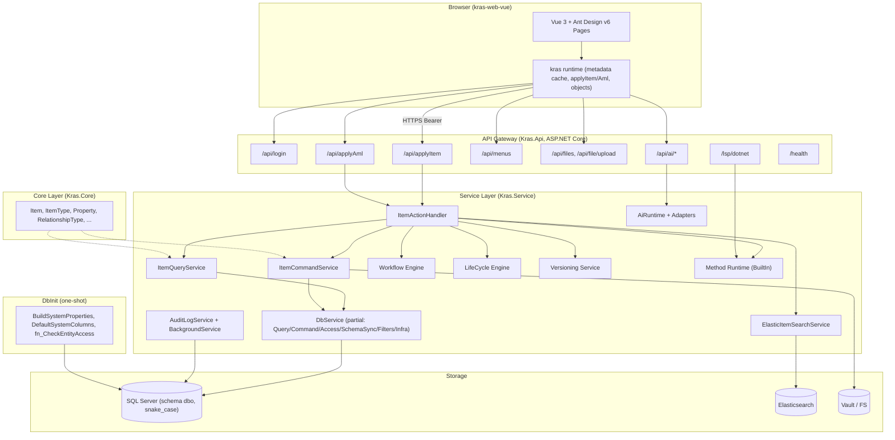
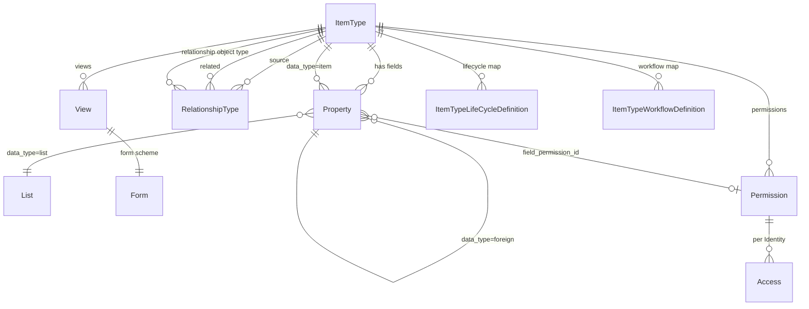

# Kras 技术设计规格说明书（Design）

> 文档版本：v1.0
> 整理日期：2026-06-17
> 输入：`requirements.md`（v1.0）、Kras 原始需求文档（2026-06-17 版）、`AGENTS.md`、`docs/` 既有协议
> 适用版本：Kras 主干（AML 协议 2.x、前端 kras-web-vue）

---

## 1. 设计总览

### 1.1 系统定位

Kras 是元数据驱动 + Item 协议驱动的企业级低代码 / PLM 平台。系统通过统一的数据建模、统一的数据交互协议（Item / AML）、统一的权限与治理能力，支撑物料 / 文档 / BOM / 变更 / 流程审批等业务对象的全生命周期管理。

### 1.2 关键架构决策

| 决策 | 选择 | 理由 |
| --- | --- | --- |
| 数据建模方式 | 元数据驱动（ItemType / Property / RelationshipType） | 满足 REQ-010、REQ-170；新增业务对象无需写代码 |
| 数据交互协议 | 统一 Item / AML（applyItem / applyAml） | 满足 REQ-020 ~ REQ-028、REQ-171；事务原子性可控 |
| 前端运行时入口 | 全局 `kras` 对象（数据 / 缓存 / 协议） | 满足 REQ-014 ~ REQ-016、REQ-075；禁止平行缓存 |
| 权限模型 | Permission + Access + 字段级权限 + fn_CheckEntityAccess | 满足 REQ-013、REQ-017、REQ-018、REQ-090、REQ-091 |
| 版本策略 | major_rev / minor_rev / generation 三段式 | 满足 REQ-030、REQ-031 |
| 生命周期与工作流联动 | 通过统一 promote action 触发 | 满足 REQ-041、REQ-056 |
| 后端方法扩展 | 服务端 C# Method + BuiltInAction | 满足 REQ-060 |
| 前端方法扩展 | 前端 JS Method（clientMethodRuntime） | 满足 REQ-061 |
| 事务副作用 | after-commit 事件分发 | 满足 REQ-028 |
| ID 规范 | 32 位无连字符（大写） | 满足 REQ-003 |
| 搜索 | ES 索引 + DB LIKE 回退 | 满足 REQ-081 |
| 部署 | Docker Compose（SQL Server + ES + API + Web） | 用户确认使用 Docker |

### 1.3 高层架构图（Mermaid）



> Mermaid 节点标签按 mermaid-label-format 规范单行书写，含 `(`、`/` 等特殊字符的标签已用引号包裹。

---

## 2. 解决方案分层与目录结构

### 2.1 后端 .NET 解决方案（Kras.sln）

```
Kras.sln
├── Kras.Core/                      # 模型层（无外部依赖）
│   ├── Items/                      # Item, ItemBase, ConstItemTypeId
│   ├── Metadata/                   # ItemType, Property, RelationshipType
│   ├── Governance/                 # Permission, Access, Identity, Team, Vault
│   ├── Lifecycle/                  # LifeCycle Definition/State/Transition
│   ├── Workflow/                   # Workflow Definition/Process/Activity
│   ├── Methods/                    # Method, ServerEvent
│   ├── Ai/                         # Ai Scenario, Provider, Tool
│   ├── Files/                      # File, Image, UploadSession
│   └── Attributes.cs               # PropertyAttribute 等
├── Kras.Service/                   # 系统能力层（依赖 Kras.Core）
│   ├── Auth/                       # PasswordHasher, TokenService
│   ├── Db/                         # SqlQueryExecutor, DbTransactionScope, DbService.*
│   ├── Item/                       # ItemQueryService, ItemCommandService, ItemActionHandler
│   ├── Metadata/                   # MetadataService, MetadataCacheInvalidationService
│   ├── Access/                     # AccessService (fn_CheckEntityAccess wrapper)
│   ├── Lifecycle/                  # LifeCycleService, PromoteService
│   ├── Workflow/                   # WorkflowEngine, AdvanceService, AssignmentService
│   ├── Versioning/                 # VersionService
│   ├── Search/                     # ItemSearchContracts, ElasticItemSearchService, DbItemSearchFallback
│   ├── Methods/                    # MethodRuntime, BuiltIn/* (Search/Workflow*/LifeCycle/FileStorage/...)
│   ├── Ai/                         # AiScenarioAdapters, AiScenarioAdapterBases, AiRuntime, AiRoadmapTools
│   ├── Files/                      # FileService, ChunkedUploadService
│   ├── Menus/                      # MenuTreeQueryService, MenuCommandService
│   ├── Audit/                      # AuditLogService（channel 入队）
│   └── Cache/                      # 系统统一缓存
├── Kras.Api/                       # 接口编排与协议转换层（依赖 Kras.Service）
│   ├── Controllers/                # ApplyItemController, ApplyAmlController, LoginController, ...
│   ├── Protocol/
│   │   ├── Item/                   # ItemRequestParser
│   │   ├── Aml/                    # AmlRequestParser
│   │   └── Response/               # ApiResponseFactory
│   ├── Host/DependencyInjection/   # ServiceCollectionExtensions（CORS/JSON/DbService/Auth/AI/LSP/Menu）
│   ├── Infrastructure/
│   │   ├── Cache/                  # RequestMetadataCache
│   │   ├── BackgroundJobs/         # AuditLogBackgroundService
│   │   ├── RateLimit/              # SensitiveRateLimiter, UploadRateLimiter
│   │   └── Middleware/             # AccessContextMiddleware, RequestDurationMiddleware
│   ├── Services/                   # Audit/AuditLogService, Metadata/MetadataCacheInvalidationService
│   └── Program.Shared.cs           # 协议解析、响应封装、共享逻辑
├── Kras.Api.Tests/                 # xUnit 测试
└── Kras.DbInit/                    # 一次性建库 / 种子
    ├── Program.cs                  # BuildSystemProperties, DefaultSystemColumns, DefaultSystemPropertyItems
    └── sqls/
        └── fn_CheckEntityAccess.sql # 唯一权限函数来源
```

### 2.2 前端项目（kras-web-vue）

```
kras-web-vue/
├── src/
│   ├── main.ts                     # 注册 Ant Design v6 + 路由 + 全局 kras
│   ├── App.vue
│   ├── router/                     # 路由表（REQ-071）
│   ├── layouts/                    # MainLayout（左菜单 + 多 Tab + 内容区）
│   ├── pages/                      # 业务页面（ItemTypeTable, ItemDetailPage, ViewEditorPage, ...）
│   ├── components/
│   │   ├── metadata-table/         # useMetadataGridColumns.ts, useMetadataGridRows.ts, ItemTypeTable.vue, RelationshipTable.vue
│   │   ├── form-components/        # helpers.ts + 基础/扩展/布局组件
│   │   ├── form-scheme/            # FormSchemeRenderer.vue
│   │   ├── item-search/            # ItemSearch 控制器
│   │   ├── definition-editor/      # DefinitionEditorPage 共用基础页
│   │   ├── ClassStructureField.vue
│   │   └── ClassSelect.vue
│   ├── data/                       # kras 运行时核心
│   │   ├── kras.item.ts            # applyItem / applyAml 入口
│   │   ├── kras.metadata.ts        # getMetadata, getItemTypeMetadata/Properties/RelationshipTypes
│   │   ├── kras.governance.ts      # 治理域（lock/unlock/promote/advanceWorkflow/...）
│   │   ├── kras.ui-bridge.ts       # UI bridge
│   │   ├── kras.cache.ts           # 只读缓存（getMetadata/getItem/getItemKeyedName/...）
│   │   ├── kras.objects.ts         # markDirty / 脏标记
│   │   ├── kras.searchItems.ts     # getController(fieldName)
│   │   └── clientMethodRuntime.ts  # 前端 JS Method 运行时
│   ├── utils/
│   │   ├── fieldValue.ts           # 字段值格式化、引用字段解析
│   │   └── metadataTable.ts        # 元数据表格通用纯工具
│   └── config/
│       ├── formFieldMapping.ts
│       ├── metadataTableReadonlyMapping.ts
│       └── metadataTableFilterMapping.ts
├── tests/
│   └── e2e/                        # Playwright E2E
└── package.json
```

### 2.3 仓库根

```
/workspace
├── Kras.sln
├── Kras.Core/ Kras.Service/ Kras.Api/ Kras.Api.Tests/ Kras.DbInit/
├── kras-web-vue/
├── scripts/
│   └── check-kras-gates.ps1        # 统一回归门禁（pwsh）
├── infra/
│   ├── docker-compose.yml          # SQL Server + ES + API + Web
│   └── dockerfiles/
├── docs/                           # 协议文档（applyItem请求动作说明.md, Item对象JSON格式规范.md, ...）
├── AGENTS.md                       # 开发强制规则
├── .monkeycode/
│   ├── MEMORY.md
│   ├── docs/                       # 项目文档
│   └── specs/kras/                 # 本次需求与设计
└── README.md
```

---

## 3. 核心数据模型

### 3.1 元数据 ER 概览（Mermaid）



### 3.2 关键表（schema `dbo`，列名 `snake_case`）

#### item_type
| 列 | 类型 | 说明 |
| --- | --- | --- |
| id | char(32) | 32 位 ID（大写） |
| name | nvarchar(128) | 唯一名称 |
| label | nvarchar(256) | 显示标签 |
| is_relationship | bit | 是否关系类 |
| is_versionable | bit | 是否可换版 |
| implementation_type | nvarchar(32) | Table / ... |
| class_structure | nvarchar(max) | 类结构 JSON |
| default_page_size | int | |
| icon | nvarchar(64) | |
| is_es_index | bit | 是否启用 ES |
| is_hidden | bit | 是否系统隐藏 |

#### property
| 列 | 类型 | 说明 |
| --- | --- | --- |
| id | char(32) | |
| source_id | char(32) | 所属 ItemType |
| name | nvarchar(128) | |
| label | nvarchar(256) | |
| data_type | nvarchar(32) | string/integer/decimal/boolean/date/list/item/foreign/... |
| data_source | char(32) | List.id / ItemType.id / Property.id（依 data_type） |
| foreign_property | char(32) | foreign 目标 Property.id |
| precision | int | |
| scale | int | |
| is_required | bit | |
| is_unique | bit | |
| default_value | nvarchar(max) | |
| sort_order | int | |
| column_width | int | |
| column_align | nvarchar(16) | |
| is_hidden | bit | |
| is_hidden2 | bit | |
| field_permission_id | char(32) | Permission.id |
| external_property | nvarchar(128) | |

#### relationship_type
| 列 | 类型 | 说明 |
| --- | --- | --- |
| id | char(32) | |
| source_id | char(32) | 源 ItemType |
| related_id | char(32) | 相关 ItemType |
| relationship_id | char(32) | 关系对象 ItemType（必须有效） |

#### permission / access
| 表 | 关键列 |
| --- | --- |
| permission | id, name, is_private, source_id (ItemType) |
| access | id, source_id (Permission), related_id (Identity), can_get, can_add, can_update, can_delete, can_discover, can_change_access, show_permissions_warning |

#### 业务表（动态生成）
所有业务对象表统一包含系统列（来自 `DefaultSystemColumns`）：`id` char(32)、`created_on`、`created_by_id`、`modified_on`、`modified_by_id`、`owned_by_id`、`managed_by_id`、`team_id`、`classification`、`state`、`major_rev`、`minor_rev`、`generation`、`is_released`、`release_date`、`is_current`、`config_id`、`locked_by_id` 等。

### 3.3 ID 生成

- 算法：自定义 32 位无连字符 ID（推荐大写），基于 GUID 去连字符再补齐 / 改写为十六进制大写。
- 实现：`Kras.Core/Items/KrasId.cs`，提供 `KrasId.NewId()`。
- 禁止复用第三方带连字符 UUID。

### 3.4 fn_CheckEntityAccess（唯一来源）

文件 `Kras.DbInit/sqls/fn_CheckEntityAccess.sql`。语义：

- 输入：`@entity_id`, `@identity_ids` (table-valued), `@action` (get/add/update/delete/discover/change_access)
- 分支 1（team）：命中 `Access.related_id = team_id`
- 分支 2（owner）：仅基于 `owned_by_id` 是否在 identity_ids 内
- 分支 3（其他显式 Access）
- 禁止把 team 合并进 owner 分支

`DbInit.Program` 必须按文件内容生成函数，禁止代码维护第二份变体。

---

## 4. Item / AML 协议设计

### 4.1 Item JSON 结构

```json
{
  "@type": "Part",
  "@action": "get",
  "@id": "A3DC4144330A4F599F278E2F231248AE",
  "@keyed_name": "PART-0001 轴承",
  "@relationships": "all",
  "item_number": "PART-0001",
  "name": "轴承",
  "make_buy": "make",
  "@Relationships": []
}
```

### 4.2 @action 解析流程

```
parseItemAction(request)
  ├─ 1. 查 Method 表：name == @action 且 enabled → 走 Method Runtime
  ├─ 2. 查 BuiltInAction 注册表（反射 [BuiltInAction] 特性）
  ├─ 3. 查 DirectBuiltInActions 静态白名单（quickSearch, startWorkflow, ...）
  └─ 4. 标准 DB action（get/new/add/edit/update/copy/lock/unlock/version/promote/delete）
```

### 4.3 ItemRequestParser / AmlRequestParser

- `ItemRequestParser`：解析单 Item 请求为 `ItemRequest { Type, Id, Action, Attributes, Relationships }`。
- `AmlRequestParser`：解析 `{"AML": [...]}` 为 `AmlRequest { Items: ItemRequest[] }`。

### 4.4 ApiResponseFactory

- 成功：优先返回裸 `data`（兼容前端），同时支持 envelope。
- 失败：返回统一错误 envelope，code 来自封闭集合。
- HTTP 状态：4xx 用于客户端错误（VALIDATION/NOT_FOUND/PERMISSION/CONFLICT），5xx 用于 INTERNAL/DATABASE/METHOD_EXECUTION_FAILED。

### 4.5 事务边界

```
applyItem(request)
  ├─ Begin TransactionScope (DbTransactionScope)
  ├─ Fire onBefore* (event methods, reuse tx)
  ├─ Dispatch action via ItemActionHandler (reuse tx)
  ├─ Fire onAfter* (event methods, reuse tx)
  ├─ Enqueue audit events (channel, not yet written)
  ├─ Enqueue after-commit side effects (ES sync, email, webhook)
  ├─ Commit tx
  └─ After commit → dispatch channel consumers (AuditLogBackgroundService, SearchIndexer, ...)
```

`applyAml` 同构，但所有 Item 共享一个外层事务。

---

## 5. 元数据驱动渲染

### 5.1 元数据加载链路

```
登录成功
  └─ await kras.getMetadata()
        ├─ Promise.all([
        │    applyItem({ @type: "ItemType", @action: "get" }),
        │    applyItem({ @type: "Property", @action: "get" }),
        │    applyItem({ @type: "RelationshipType", @action: "get" })
        │  ])
        ├─ 写入 kras.cache（内存 + localStorage）
        └─ 返回
```

### 5.2 只读缓存 API

- `kras.cache.getMetadata()` / `getItemTypeMetadata(name)` / `getItemTypeProperties(name)` / `getItemTypeRelationshipTypes(name)`
- `getItem(id)` / `getItemKeyedName(id)`
- 命中失败返回空值，不在缓存层补请求。

### 5.3 缓存清理策略

- 业务对象修改：不清元数据缓存。
- 类型级修改（ItemType/Property/RelationshipType/View/Form）：调 `MetadataCacheInvalidationService` 清对应键。
- 全量：`kras.reset()` / `kras.cache.clearItemType()`。

### 5.4 字段级权限

- 后端在返回 Property 元数据时按当前 identityIds 过滤 `can_view`。
- 列表查询、详情查询的 SELECT 投影按可见字段裁剪，避免大字段泄露。
- 前端 readonly 由 `readonly=true` 或 `can_edit=false` 决定。

---

## 6. 列表页与详情页设计

### 6.1 ItemTypeTable

- 列：来自 `kras.cache.getItemTypeProperties(name)`，按 `sort_order` 排序，`is_hidden=1` 跳过。
- 列宽：`column_width`；列对齐：`column_align`。
- 筛选行：第一行可输入，提交时构造后端 filter（`>100`、`<=50`、`<2025/01/11`、`*123*`），由后端 `QueryFilters` 解析。
- 引用列：值存 id，显示走 `@keyed_name`。
- 空数据：仍渲染列结构，列定义不依赖行数据。
- 双击行：打开详情 Tab。

### 6.2 ItemDetailPage

- 顶部：keyed_name + 操作按钮区。
- 中部：表单区域。表单 scheme 优先；缺省时按 Properties fallback。
- 底部：Relationship Tabs。Tab 标题来自 RelationshipType.label；首次激活才加载行数据。

### 6.3 首屏最小集

阻塞：主对象 + `getItemTypeMetadata` + `getItemTypeProperties`。
非阻塞：RelationshipTypes、Relationship View、关系行。

### 6.4 编辑与保存

- 字段变化 → 更新 draft + `kras.objects.markDirty(id)`。
- 保存：applyItem(`@action=update`)，回包为准，强制刷新主对象 + 定向刷新脏关系。
- 新 id 路径切换：先 `router.replace` 到新路径，再刷新主对象。

---

## 7. 治理域设计（版本 / 生命周期 / 工作流）

### 7.1 版本（VersionService）

```
version(item)
  ├─ if ItemType.is_versionable != 1 → return { version_skipped: true, reason: "not_versionable" }
  ├─ load current (major_rev, minor_rev, generation, is_released)
  ├─ if is_released == 1:
  │     new_major = next_alpha(major_rev)
  │     new_minor = "1"
  ├─ else:
  │     new_major = major_rev
  │     new_minor = increment(minor_rev)
  ├─ new_generation = generation + 1
  ├─ new state = resolveLifecycleStartState(itemType, classification)
  │     (default_state_id → is_start → is_released=false)
  ├─ if new state.is_released == 1: set is_released=1, release_date=now
  │   else: recompute based on target state
  ├─ clone row with new id, new rev, generation, state, is_current=1
  ├─ old row.is_current = 0
  └─ return new item
```

### 7.2 生命周期（LifeCycleService / PromoteService）

```
promote(item, transition_id, [workflow_context])
  ├─ resolve current state from item.state
  │     if missing/empty/unmatched → ERROR
  ├─ load transition by id (must belong to current lifecycle map)
  ├─ validate source state == item.state
  ├─ if transition.require_workflow_context:
  │     validate workflow_process_id / workflow_map_id / workflow_map_activity_id / workflow_map_path_id
  ├─ Fire global onBeforePromote
  ├─ Fire transition.onBeforePromote
  ├─ UPDATE item SET state = transition.target_state_id
  ├─ if target.is_released == 1: set is_released=1, release_date=now
  ├─ Fire transition.onAfterPromote
  ├─ Fire global onAfterPromote
  └─ audit log
```

### 7.3 工作流引擎（WorkflowEngine）

#### 启动

```
startWorkflow(item, [workflow_map_id])
  ├─ resolve map via ItemType Workflow Map (manual scope, start_state_id check)
  ├─ if is_default and no explicit map_id → use default
  ├─ instantiate: Workflow Process + Lanes + Nodes + Edges
  ├─ create first Activity + Activity Assignments (skip if Activity Template.is_automatic)
  ├─ fire onBeforeActivate / onAfterActivate / onBeforeAssign / onAfterAssign
  └─ return process_id
```

#### 流转

```
advanceWorkflow(process, [path_id], [next_activity_id])
  ├─ if current node has assignments:
  │     validate all required signers submitted
  ├─ resolve path:
  │     if explicit path_id → use
  │     elif default path exists → use
  │     elif single path → use
  │     else ERROR (require path_id/next_activity_id)
  ├─ Fire path.onBeforeTransit (may return route_selected/route_skip/...)
  ├─ if path.life_cycle_transition_id:
  │     promote(item, path.life_cycle_transition_id, workflow_context=this)
  ├─ move token to next activity
  ├─ if next.is_automatic and not end → recurse advanceWorkflow (with loop guard)
  ├─ Fire path.onAfterTransit + node onBeforeComplete/onAfterComplete
  └─ audit
```

#### 签核操作

| Action | 行为 |
| --- | --- |
| submitApproval | 写 approval_action/result/comment/completed_*；如有 reject 结论标记 reject 路径 |
| approveWorkflow | 等价 submitApproval + approve |
| rejectWorkflow | 等价 submitApproval + reject（路径需明确） |
| addSign/removeSign | 增删 signer，复用同 Identity 活动 assignment |
| delegate | 源 assignment=Delegated，目标 assignment 创建/复用；onBefore/AfterDelegate |
| transfer/reassign | 源 assignment=Transferred |
| takeOver | 源 assignment=TakenOver；未传目标默认当前登录主 Identity（Alias 优先） |

#### 节点表单

- `getWorkflowNodeForm(activity_id)`：按 Workflow Map Activity 取 form scheme。
- `getWorkflowProcessForm(process_id)`：按流程实例当前节点取 form scheme。
- 节点未配置表单 → 显式报错。

---

## 8. 方法体系

### 8.1 服务端 Method Runtime

- 注册：反射扫描 `Kras.Service/Methods/BuiltIn/*` 上的 `[BuiltInAction("name")]`。
- 调度：`ItemActionHandler` 先查 Method 表（数据库 Method）→ 再查 BuiltIn 注册 → 再查 DirectBuiltInActions 白名单 → 最后标准 DB action。
- Method 内如需写库：必须复用当前事务，调 `applyItem/applyAml`。
- 编译检查：`/api/methods/compile-check`，使用 Roslyn。
- LSP：`/lsp/dotnet`，使用 OmniSharp / Roslyn LSP。

### 8.2 前端 JS Method Runtime（clientMethodRuntime）

- 绑定：View 编辑器把组件事件（`button.click`、`*.change`）绑定到 `method_type=js/javascript` 的 Method。
- 执行：`methods` 按 `sort_order` 升序执行。
- 输入：`execute(item, context)`，item = 「当前对象 + 当前表单值 + 本次改动」合并。
- 注入：`kras` / `message` / `Modal` / `context`。
- 返回：item 对象，自动回填表单。
- 支持 sync 与 async。

---

## 9. 权限与安全

### 9.1 鉴权链路

```
HTTP Request
  ├─ AccessContextMiddleware: parse Authorization: Bearer {token}
  ├─ TokenService.Validate(token) → identityIds
  ├─ inject AccessContext { userId, identityIds, teamIds }
  └─ next()
```

### 9.2 限流

- `SensitiveRateLimiter`：`/api/login`, `/api/ai/*`, `/api/methods/compile-check`。
- `UploadRateLimiter`：`/api/file/upload`。
- 实现：基于 .NET 8 内置 `RateLimiter`（固定窗口 + 令牌桶组合）。

### 9.3 实体权限

- 所有 Query / Command 在生成 SQL 前调用 `AccessService.CheckEntityAccess(entityId, identityIds, action)`，调用 `fn_CheckEntityAccess` 表值函数。
- 列表查询：把 identity_ids 作为 TVP 传入，SQL 内 join `fn_CheckEntityAccess(...)`。

### 9.4 字段级权限

- 元数据返回按 `can_view` 过滤。
- SQL 投影按可见字段裁剪。
- 后端最终校验在 `get/quickSearch/update/add/version/applyAml`。

---

## 10. 文件与存储

- `File` / `Image` 表存元数据，blob 落 Vault（FS / S3 兼容）。
- 分片上传：客户端创建 `Upload Session`，按 chunk 上传 `Upload Chunk`，完成后合并写入 Vault 并创建 `File` 记录。
- 端点：`/api/file/upload`（upload rate limit）、`/api/files/{id}`。
- 预览：`File Preview Rule` 配置 + `/file-preview/{ItemTypeName}/{id}` 页面。

---

## 11. 菜单管理

```
GET /api/menus
  └─ MenuTreeQueryService
        ├─ load custom MenuItem tree (filtered by identityIds)
        ├─ load ItemType where is_hidden=0
        │     → group node: label ?? name, path /item-types/{name}
        ├─ merge: custom items + ItemType group nodes
        └─ return tree
```

CRUD：`MenuItemCreate` / `MenuItemUpdate` / `MenuTreeReorderRequest`，支持级联删除。

---

## 12. AI 能力

- 配置对象：Ai Scenario (+Version) / Ai Prompt Template / Ai Skill / Ai Tool / Ai MCP Server / Ai Provider Profile / 绑定。
- 端点：`/api/ai/layout`、`/api/ai/item-detail-draft`、`/api/ai/method-edit`（敏感限流）。
- 适配器：`Kras.Service/Ai/AiScenarioAdapters` + `AiScenarioAdapterBases`，运行时 `AiRuntime`。
- 前端：`/ai-management`。

---

## 13. 审计与可观测

```
applyItem / applyAml 链路
  └─ AuditLogService.Enqueue(event)  // channel（内存 Channel<T>）
        │
        ▼
  AuditLogBackgroundService（后台 worker）
        └─ 批量 / 异步写入 audit_log 表
```

- `/health` 端点：DB / ES / Vault 探活。
- 请求耗时日志 + AccessContext 注入。
- 高频路径禁止输出大对象 / 敏感字段。

---

## 14. 高性能策略

### 14.1 前端

| 场景 | 策略 |
| --- | --- |
| 列表 / 关系表 / 大表 | 分页 + 虚拟滚动 + 列窗口 |
| 列定义 | 元数据驱动，不依赖行数据 |
| 搜索 / 筛选 / 排序 | 下推后端 |
| key | 业务 id / 关系 id / 行 key |
| 大弹窗 / 大表格 / 编辑器 | 按打开状态懒加载 |
| X6 / Monaco / 图表 / 地图 | 等 container ready 再初始化，卸载释放 |
| 异步结果 | 请求序号控制，过期结果丢弃 |

### 14.2 后端

| 场景 | 策略 |
| --- | --- |
| 查询构造 | 元数据 + 字段权限 + 实体权限统一构造 |
| 列表 | 分页 + 投影，禁止 `select *` |
| 详情 | 按 `@relationships` 控制返回 |
| 批量 | `applyAml` 单事务 |
| 缓存 | 请求级 + 系统统一缓存 |
| N+1 | 收口批量查询 / 统一缓存读取（元数据、keyed_name、列表值、权限） |
| 大批量 | 分批 / 流式 / 后台化 |

---

## 15. 部署架构（Docker）

### 15.1 docker-compose 拓扑

```mermaid
graph LR
    User["User Browser"] --> Web["kras-web (nginx, :80)"]
    Web --> Api["kras-api (.NET 8, :8080)"]
    Api --> DB[("mcr.microsoft.com/mssql/server (SQL Server)")]
    Api --> ES[("docker.elastic.co/elasticsearch/elasticsearch")]
    Api --> Vault[("kras-vault volume)"]
```

### 15.2 服务清单

| 服务 | 镜像 | 端口 | 依赖 |
| --- | --- | --- | --- |
| sqlserver | mcr.microsoft.com/mssql/server:2022-latest | 1433 | - |
| elasticsearch | docker.elastic.co/elasticsearch/elasticsearch:8.x | 9200 | - |
| kras-dbinit | 本地构建（Kras.DbInit） | - | sqlserver |
| kras-api | 本地构建（Kras.Api） | 8080 | sqlserver, elasticsearch |
| kras-web | 本地构建（nginx + kras-web-vue dist） | 80 | kras-api |

### 15.3 配置（环境变量）

| 变量 | 用途 |
| --- | --- |
| ConnectionStrings__Kras | SQL Server 连接串 |
| Elastic__Uri | ES 地址 |
| Elastic__DefaultIndex | 默认索引名 |
| Vault__RootPath | Vault 根目录 |
| Jwt__Secret / Jwt__Issuer / Jwt__Audience | JWT 配置 |
| RateLimit__Sensitive / RateLimit__Upload | 限流参数 |
| Cors__AllowedOrigins | CORS 白名单 |

---

## 16. 质量门禁

### 16.1 scripts/check-kras-gates.ps1

```powershell
# Unified Kras regression gate (must run with pwsh)
# 1. Backend build
dotnet build Kras.sln -c Release
if ($LASTEXITCODE -ne 0) { Write-Error "Backend build failed"; exit 1 }

# 2. Backend tests
dotnet test Kras.Api.Tests/Kras.Api.Tests.csproj -c Release
if ($LASTEXITCODE -ne 0) { Write-Error "Backend tests failed"; exit 1 }

# 3. Frontend lint
Push-Location kras-web-vue
npm run lint
if ($LASTEXITCODE -ne 0) { Write-Error "Frontend lint failed"; Pop-Location; exit 1 }

# 4. Frontend build
npm run build
if ($LASTEXITCODE -ne 0) { Write-Error "Frontend build failed"; Pop-Location; exit 1 }

Pop-Location
Write-Host "All gates passed."
```

### 16.2 E2E

- 框架：Playwright（kras-web-vue/tests/e2e）。
- 流程：homepage → menu → button → search → login → page links → forward/back/refresh。
- 证据：截图 + Console error-free + Network no failed requests。

---

## 17. 与需求的追溯矩阵（节选）

| 需求 ID | 设计章节 |
| --- | --- |
| REQ-010 元数据对象清单 | §3.1, §2.1 (Kras.Core) |
| REQ-013 fn_CheckEntityAccess | §3.4, §9.3 |
| REQ-020 Item 统一数据单元 | §4.1, §4.2 |
| REQ-026 applyItem 事务 | §4.5 |
| REQ-028 after-commit 副作用 | §4.5, §13 |
| REQ-031 version 规则 | §7.1 |
| REQ-041 promote | §7.2 |
| REQ-050 工作流启动 | §7.3 |
| REQ-056 工作流-生命周期联动 | §7.3 |
| REQ-060 服务端 Method | §8.1 |
| REQ-061 前端 JS Method | §8.2 |
| REQ-072 ItemTypeTable | §6.1 |
| REQ-073 ItemDetailPage | §6.2 ~ §6.4 |
| REQ-081 quickSearch | §3.2 (is_es_index), §14.2 |
| REQ-150 前端性能 | §14.1 |
| REQ-151 后端性能 | §14.2 |
| REQ-162 提交前检查 | §16.1 |

---

## 18. 风险与对策

| 风险 | 影响 | 对策 |
| --- | --- | --- |
| 32 位 ID 与第三方 UUID 冲突 | 数据迁移污染 | 全链路强制 `KrasId.NewId()`，单元测试覆盖 |
| fn_CheckEntityAccess 双套维护 | 权限漏洞 | 单一来源 + 集成测试对照 SQL 文件 |
| applyAml 大事务超时 | 锁表 | 分批 / 后台化（REQ-151） |
| 工作流自动节点死循环 | 引擎挂死 | loop guard（REQ-053） |
| after-commit 副作用丢失 | 索引不一致 | outbox 表 + 重试 worker（可选增强） |
| ES 与 DB 不一致 | 搜索漏数据 | after-commit + 失败重试 + 定期全量重建 |
| 前端缓存脏读 | 字段级权限泄露 | 类型级修改触发 `MetadataCacheInvalidationService` |
| 跨平台 pwsh 依赖 | 门禁失败 | 容器内预装 pwsh；提供 `check-kras-gates.sh` 兜底（仅 Linux 沙箱用，不替代正式门禁） |

---

> 下一步：以本文档为输入生成 `tasklist.md`（任务拆解与里程碑）。
